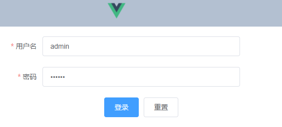
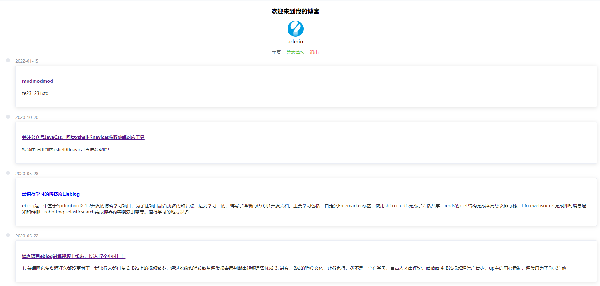
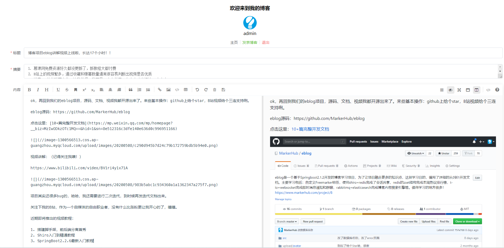

# 版权声明
本项目为学习交流项目，参考自MarkerHub的vueblog[https://github.com/MarkerHub/vueblog]

> **项目：vueblog**
>
> **公众号：MarkerHub**

### 介绍

一个基于SpringBoot + Vue开发的前后端分离博客项目，带有超级详细开发文档和讲解视频。还未接触过vue开发，或者前后端分离的同学，学起来哈。别忘了给vueblog一个star！感谢

### 开发文档

https://juejin.im/post/5ecfca676fb9a04793456fb8

# 项目地址
- 前端：https://github.com/AHawkeye/vueblog-frontend
- 后端：https://github.com/AHawkeye/vueblog
# 项目效果图







# 后端开发环境

- jdk8
- IDEA 2020
- MybatisPlus 3.2.0
- MySQL 8.0.23
- Springboot 2.6.2
- Maven
- Lombok
- Shiro
- Redis-x64-5.0.10
- hutool

## 导入数据

新建一个数据库`vueblog` 然后用下列脚本导入数据

```SQL
SET FOREIGN_KEY_CHECKS=0;

-- ----------------------------
-- Table structure for m_blog
-- ----------------------------
DROP TABLE IF EXISTS `m_blog`;
CREATE TABLE `m_blog` (
  `id` bigint(20) NOT NULL AUTO_INCREMENT,
  `user_id` bigint(20) NOT NULL,
  `title` varchar(255) NOT NULL,
  `description` varchar(255) NOT NULL,
  `content` longtext,
  `created` datetime NOT NULL ON UPDATE CURRENT_TIMESTAMP,
  `status` tinyint(4) DEFAULT NULL,
  PRIMARY KEY (`id`)
) ENGINE=InnoDB AUTO_INCREMENT=15 DEFAULT CHARSET=utf8mb4;

-- ----------------------------
-- Records of m_blog
-- ----------------------------
INSERT INTO `m_blog` VALUES ('1', '1', '生活就像海洋，只有意志坚强的人才能到达彼岸', '这里是摘要哈哈哈', '内容？？？', '2020-05-21 22:08:42', '0');
INSERT INTO `m_blog` VALUES ('2', '1', '最值得学习的博客项目eblog', 'eblog是一个基于Springboot2.1.2开发的博客学习项目，为了让项目融合更多的知识点，达到学习目的，编写了详细的从0到1开发文档。主要学习包括：自定义Freemarker标签，使用shiro+redis完成了会话共享，redis的zset结构完成本周热议排行榜，t-io+websocket完成即时消息通知和群聊，rabbitmq+elasticsearch完成博客内容搜索引擎等。值得学习的地方很多！', '**推荐阅读：**\r\n\r\n[分享一套SpringBoot开发博客系统源码，以及完整开发文档！速度保存！](https://mp.weixin.qq.com/s/jz6e977xP-OyaAKNjNca8w)\r\n\r\n[Github上最值得学习的100个Java开源项目，涵盖各种技术栈！](https://mp.weixin.qq.com/s/N-U0TaEUXnBFfBsmt_OESQ)\r\n\r\n[2020年最新的常问企业面试题大全以及答案](https://mp.weixin.qq.com/s/lR5LC5GnD2Gs59ecV5R0XA)', '2020-05-28 09:36:38', '0');
INSERT INTO `m_blog` VALUES ('3', '1', '关注公众号JavaCat，回复xshell或navicat获取破解对应工具', '视频中所用到的xshell和navicat直接获取哈！', '### 工具获取\r\n\r\n* xshell 6 绿色破解版：关注公众号：JavaCat，回复 xshell 获取\r\n* Navicat 11 简体中文版：关注公众号：JavaCat，回复 navicat 获取\r\n\r\n公众号二维码：\r\n\r\n\r\n\r\n直接扫码回复对应关键字\r\n\r\n**推荐阅读：**\r\n\r\n[B站86K播放量，SpringBoot+Vue前后端分离完整入门教程！](https://mp.weixin.qq.com/s/jGEkHTf2X8l-wUenc-PpEw)\r\n\r\n[分享一套SpringBoot开发博客系统源码，以及完整开发文档！速度保存！](https://mp.weixin.qq.com/s/jz6e977xP-OyaAKNjNca8w)\r\n\r\n[Github上最值得学习的100个Java开源项目，涵盖各种技术栈！](https://mp.weixin.qq.com/s/N-U0TaEUXnBFfBsmt_OESQ)\r\n\r\n[2020年最新的常问企业面试题大全以及答案](https://mp.weixin.qq.com/s/lR5LC5GnD2Gs59ecV5R0XA)', '2020-10-20 05:05:31', '0');
INSERT INTO `m_blog` VALUES ('7', '1', '你真的会写单例模式吗?', '单例模式可能是代码最少的模式了，但是少不一定意味着简单，想要用好、用对单例模式，还真得费一番脑筋。本文对 Java 中常见的单例模式写法做了一个总结，如有错漏之处，恳请读者指正。', '> 作者：吃桔子的攻城狮 来源：http://www.tekbroaden.com/singleton-java.html\n\n\n单例模式可能是代码最少的模式了，但是少不一定意味着简单，想要用好、用对单例模式，还真得费一番脑筋。本文对 Java 中常见的单例模式写法做了一个总结，如有错漏之处，恳请读者指正。\n\n饿汉法\n===\n\n顾名思义，饿汉法就是在第一次引用该类的时候就创建对象实例，而不管实际是否需要创建。代码如下：\n\n```\npublic class Singleton {  \n    private static Singleton = new Singleton();\n    private Singleton() {}\n    public static getSignleton(){\n        return singleton;\n    }\n}\n\n```\n\n这样做的好处是编写简单，但是无法做到延迟创建对象。但是我们很多时候都希望对象可以尽可能地延迟加载，从而减小负载，所以就需要下面的懒汉法：\n', '2020-05-22 00:42:44', '0');
INSERT INTO `m_blog` VALUES ('9', '1', '真正理解Mysql的四种隔离级别@', '事务是应用程序中一系列严密的操作，所有操作必须成功完成，否则在每个操作中所作的所有更改都会被撤消。也就是事务具有原子性，一个事务中的一系列的操作要么全部成功，要么一个都不做。\n\n事务的结束有两种，当事务中的所以步骤全部成功执行时，事务提交。如果其中一个步骤失败，将发生回滚操作，撤消撤消之前到事务开始时的所以操作。', '### 什么是事务  \n\n> 事务是应用程序中一系列严密的操作，所有操作必须成功完成，否则在每个操作中所作的所有更改都会被撤消。也就是事务具有原子性，一个事务中的一系列的操作要么全部成功，要么一个都不做。\n> \n> 事务的结束有两种，当事务中的所以步骤全部成功执行时，事务提交。如果其中一个步骤失败，将发生回滚操作，撤消撤消之前到事务开始时的所以操作。\n\n**事务的 ACID**\n\n事务具有四个特征：原子性（ Atomicity ）、一致性（ Consistency ）、隔离性（ Isolation ）和持续性（ Durability ）。这四个特性简称为 ACID 特性。\n\n> 1 、原子性。事务是数据库的逻辑工作单位，事务中包含的各操作要么都做，要么都不做\n> \n> 2 、一致性。事 务执行的结果必须是使数据库从一个一致性状态变到另一个一致性状态。因此当数据库只包含成功事务提交的结果时，就说数据库处于一致性状态。如果数据库系统 运行中发生故障，有些事务尚未完成就被迫中断，这些未完成事务对数据库所做的修改有一部分已写入物理数据库，这时数据库就处于一种不正确的状态，或者说是 不一致的状态。', '2020-05-22 22:04:46', '0');
INSERT INTO `m_blog` VALUES ('10', '1', '博客项目eblog讲解视频上线啦，长达17个小时！！', '1. 慕课网免费资源好久都没更新了，新教程大都付费\n2. B站上的视频繁多，通过收藏和弹幕数量通常很容易判断出视频是否优质\n3. 讲真，B站的弹幕文化，让我觉得，我不是一个在学习，自古人才出评论。哈哈哈\n4. B站视频通常广告少，up主的用心录制，通常只为了你关注他', 'ok，再回到我们的eblog项目，源码、文档、视频我都开源出来了。来些基本操作：github上给个star，B站视频给个三连支持咧。\n\neblog源码：https://github.com/MarkerHub/eblog\n\n点击这里：[10+篇完整开发文档](https://mp.weixin.qq.com/mp/homepage?__biz=MzIwODkzOTc1MQ==&hid=1&sn=8e512316c3dfe140e636d0c996951166)\n\n\n\n视频讲解：（记得关注我噢！）\n\nhttps://www.bilibili.com/video/BV1ri4y1x71A\n\n\n\n项目其实还很多bug的，哈哈，我还需要进行二次迭代，到时候再发迭代文档出来。\n\n关注下我的B站，作为一个自媒体的自由职业者，没有什么比涨粉更让我开心的了，嘻嘻。\n\n近期即将推出的视频教程：\n\n1. 搭建脚手架，前后端分离首秀\n2. Shiro入门到精通教程\n3. SpringBoot2.2.6最新入门教程', '2020-05-22 22:05:49', '0');

-- ----------------------------
-- Table structure for m_user
-- ----------------------------
DROP TABLE IF EXISTS `m_user`;
CREATE TABLE `m_user` (
  `id` bigint(20) NOT NULL AUTO_INCREMENT,
  `username` varchar(64) DEFAULT NULL,
  `avatar` varchar(255) DEFAULT NULL,
  `email` varchar(64) DEFAULT NULL,
  `password` varchar(64) DEFAULT NULL,
  `status` int(5) NOT NULL,
  `created` datetime DEFAULT NULL,
  `last_login` datetime DEFAULT NULL,
  PRIMARY KEY (`id`),
  KEY `UK_USERNAME` (`username`) USING BTREE
) ENGINE=InnoDB AUTO_INCREMENT=2 DEFAULT CHARSET=utf8;

-- ----------------------------
-- Records of m_user
-- ----------------------------
```
**后端测试运行记得打开redis服务**
# 前端开发环境

- vue
- element-ui
- axios
- mavon-editor
- markdown-it
- github-markdown-css

# 致谢

非常感谢MarkerHub提供的学习机会与课程！
